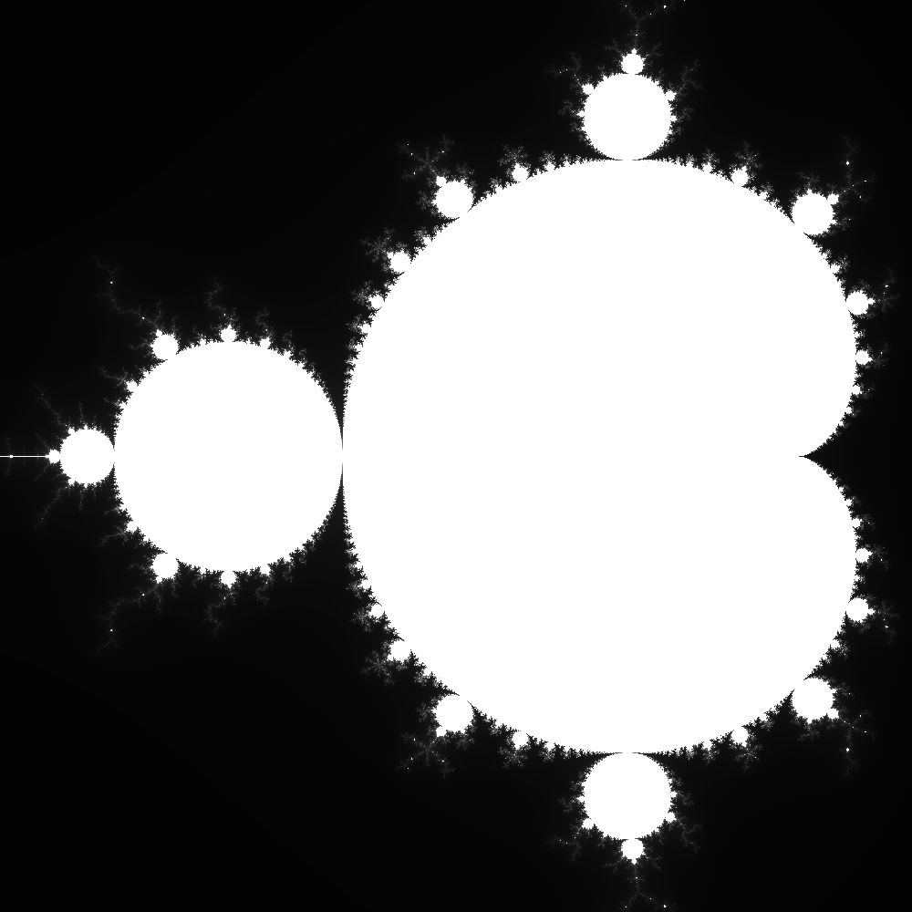

# Fractal Generator

Fractal generator is a cmd tool written in Rust programming language capable of creating variable size images of julia sets and the mandelbrot set itself

## Julia sets

In order to create Julia set write `julia` when program asks You for the fractal type. After that You will be prompted to input julia constant, which is a complex number.

*Example Julia set. Constant used in the example: `0.2 + 0.55i`. Zoom is `0.4`*

## Mandelbrot set

In order to create Mandelbrot set write `mandelbrot` when program asks You for the fractal type. For the best picture of the set, I recommend setting x offset to `-0.5`

*Example Mandelbrot set. X offset set to `-0.5` and zoom to `0.5`*