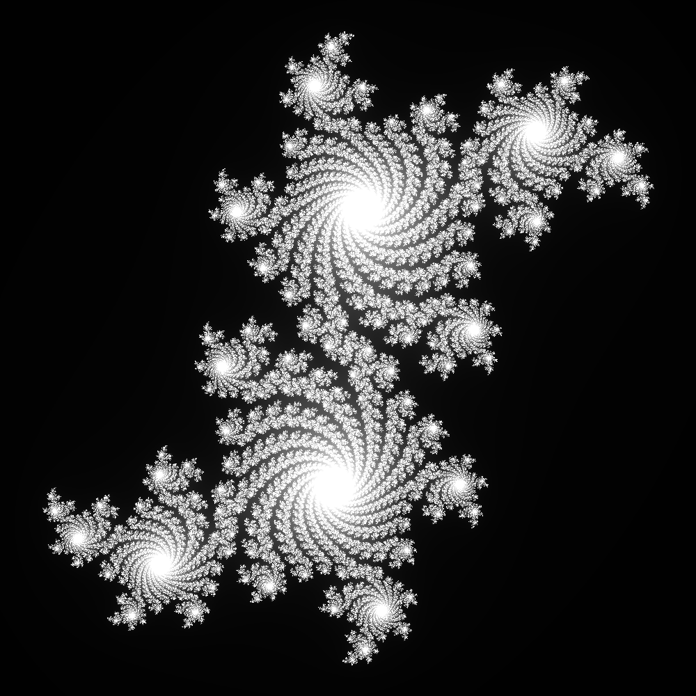

# Fractal Generator

Fractal generator is a cmd tool written in the Rust programming language, capable of generating variable size images of Julia sets and the Jandelbrot set itself.

## Julia sets

In order to create a Julia set, type `julia` when the program asks You for the fractal type. You will then be asked to enter the Julia constant, which is a complex number.

*Example Julia set. Constant used in the example: `0.2 + 0.55i`. Zoom is `0.4`*

## Mandelbrot set

In order to create a Mandelbrot set, type `mandelbrot` when the program asks You for the fractal type. To get the best image of the set, I recommend to set the x_offset to `-0.5`

*Example Mandelbrot set. X offset set to `-0.5` and zoom to `0.5`*